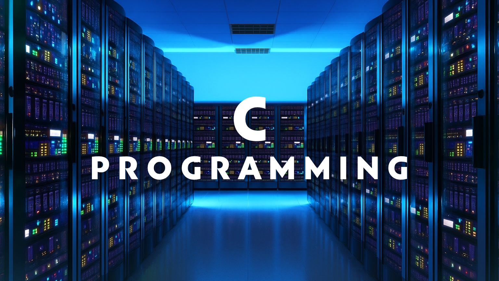

## **What is C?**

C is a **systems programming language** that was once considered high-level but is now often regarded as low-level compared to modern languages.
It provides:

* **Direct memory control** – You can manage and manipulate memory exactly as you want.
* **Complex control structures** – Full flexibility to create sophisticated logic.
* **Access to system-level APIs** – Direct interaction with the kernel and operating system.

---

### **C is Hard.**

C gives you the power to **do anything**—including making catastrophic mistakes.
The language assumes **you know what you’re doing**, and it won’t stop you from making errors.

For example:

* If you allocate memory on the heap with `malloc()`, **you must** release it with `free()`.
* If you create a buffer for user input, **you must** ensure the data fits—C won’t do it for you.
* Forgetting these rules can lead to crashes, memory leaks, or security vulnerabilities.

---

### **…So Why Bother?**

Yes, C is difficult—but it’s worth learning because:

* **It builds strong fundamentals** – You’ll understand how computers work at a low level.
* **It makes learning other languages easier** – Once you understand C, picking up Python, JavaScript, or other languages becomes much simpler.
* **It’s still everywhere** – Operating systems, embedded devices, databases, and game engines still rely heavily on C.

> Learning C is like learning to drive a manual car—you may not use it every day, but it teaches you skills that make you a better driver in any vehicle.

---